# 架构

本页介绍 WeiLink 的内部架构，包括模块结构、消息路由、登录流程、媒体处理及可选的管理面板。

## 包结构

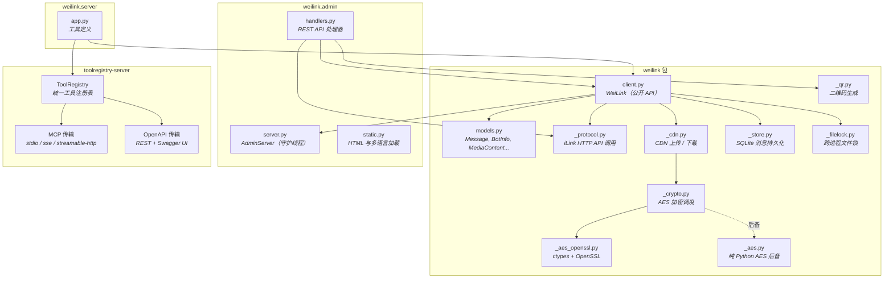

## 多会话架构

WeiLink 支持多个并发会话。每个会话代表一个独立的微信账号注册到机器人。

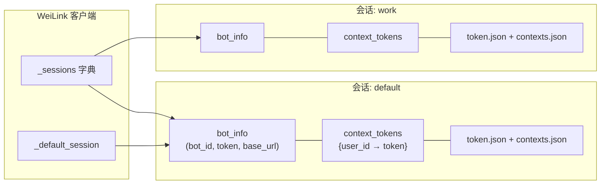

### 接收流程

`recv()` 使用线程池**并行轮询所有活跃会话**，将结果合并为统一的消息列表。每条 `Message` 都携带 `bot_id` 字段，标识它来自哪个会话。

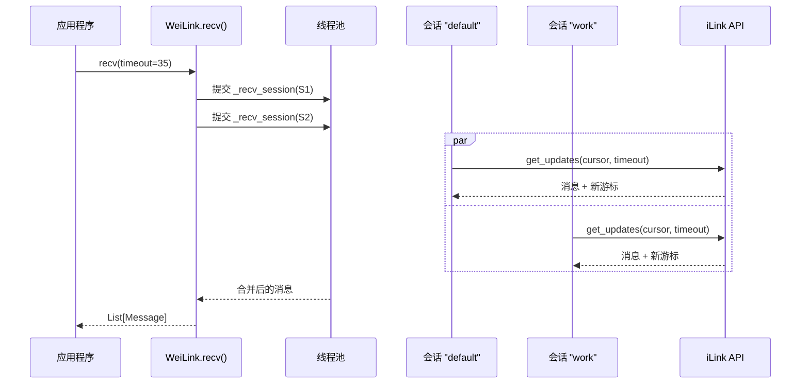

### 发送路由

`send()` 根据目标用户最近的 `context_token` 所在会话**自动路由**到正确的会话。无需手动指定会话。

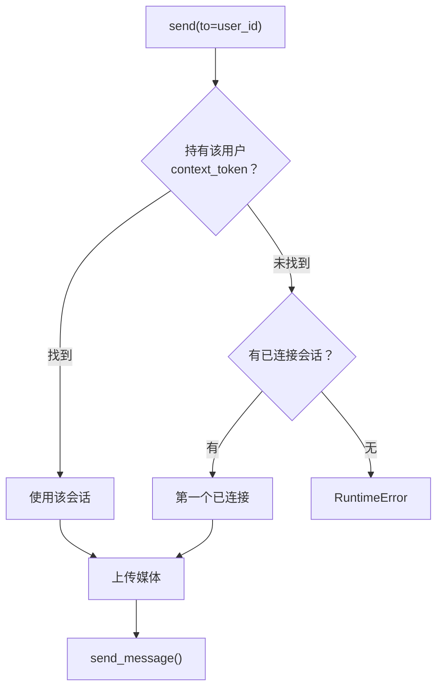

## 跨进程文件锁

当多个进程共享同一数据目录时（例如 SDK 脚本和 stdio MCP 服务器同时使用 `~/.weilink/`），WeiLink 通过两把基于 `fcntl.flock()` 的文件锁协调访问：

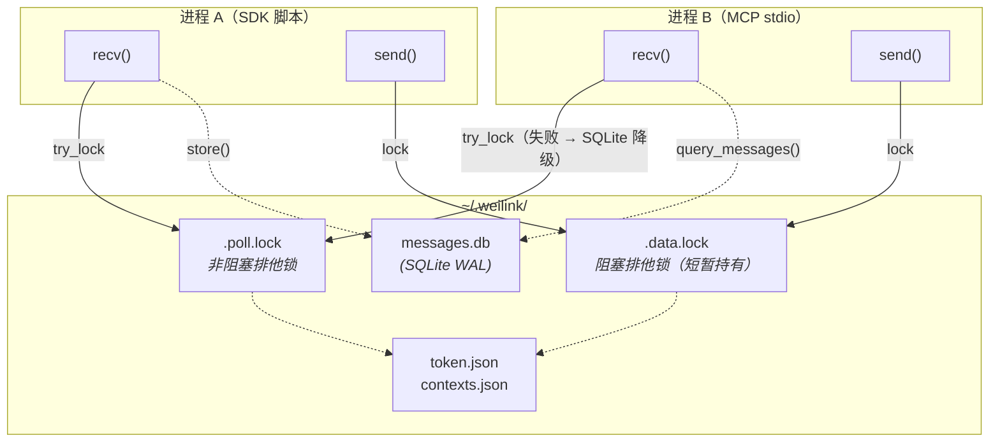

| 锁 | 作用范围 | 行为 |
|----|----------|------|
| `.poll.lock` | 整个 `recv()` 周期 | 非阻塞 try-lock。被其他进程持有时，`recv()` 降级从 SQLite 读取（如已启用），否则返回 `[]`。防止 cursor 分叉。 |
| `.data.lock` | 文件读-改-写 | 阻塞式，短暂持有（~毫秒级）。序列化 `token.json` / `contexts.json` 的访问，`recv()` 和 `send()` 均使用。 |

**核心原则：** 磁盘是唯一事实来源。每次 `recv()` 和 `send()` 在数据锁下重新从磁盘读取状态后再执行操作，确保其他进程的变更可见。

**原子文件写入：** 所有对 `token.json`、`contexts.json` 和 `.default_session` 的写入均使用"写临时文件 + `os.replace()`"模式，确保进程崩溃不会产生损坏的文件。

在 Windows 上，文件锁被跳过（无 `fcntl`），WeiLink 的行为与之前一致。

### Route C — 协作式轮询降级

当启用 `message_store` 且轮询锁被其他进程持有时，`recv()` 从 SQLite 存储中读取最近的消息（最近 60 秒），而不是返回空列表。这使得次级进程无需与主轮询者的 cursor 冲突即可获取消息。

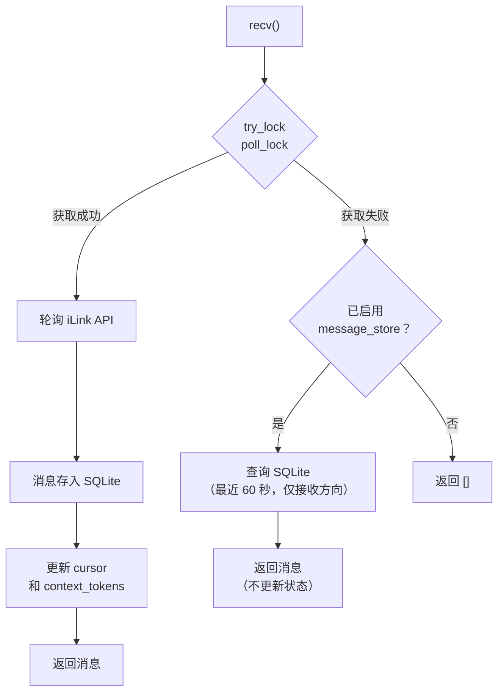

降级读取期间不会更新 cursor 或 context_token — 这些消息在主轮询者存储时已完成处理。降级读取是纯只读操作，完全安全。

**激活条件：** 同时满足两个条件时自动启用：轮询锁被其他进程持有，且 `message_store` 已启用（`message_store=True`）。

## 消息持久化（SQLite 存储）

WeiLink 包含一个可选的 SQLite 消息存储后端，记录所有收发消息的完整序列化数据（保留 CDN 引用以便后续媒体下载）。

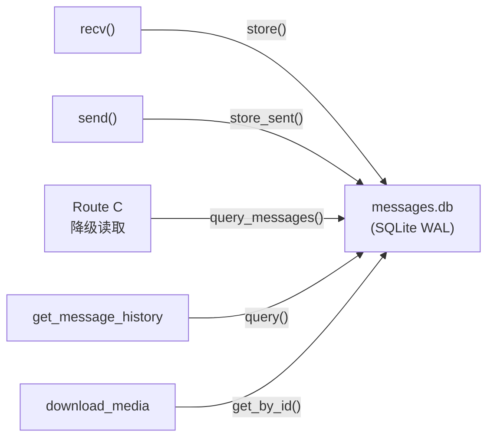

| 特性 | 描述 |
|------|------|
| **WAL 模式** | 并发读者 + 单写者。读者不阻塞写者，写者不阻塞读者。 |
| **幂等写入** | 基于 `message_id` 的 `INSERT OR IGNORE`，防止重复写入。 |
| **自动清理** | 可配置按时间（默认 30 天）和条数（默认 10 万条）清理。 |
| **线程安全** | 内部写锁 + SQLite 自身锁机制。 |
| **跨进程安全** | SQLite WAL 模式处理多进程并发访问。 |

### 启用方式

- **Server 模式**：始终启用（server 中默认 `message_store=True`）。
- **SDK 模式**：通过 `WeiLink(message_store=True)` 或 `WeiLink(message_store="/path/to/messages.db")` 手动启用。
- **未启用**（SDK 默认）：单客户端模式，运行时无 SQLite 依赖。

### 多客户端协调总结

WeiLink 通过四种机制支持多个进程共享同一数据目录：

1. **轮询锁**（`.poll.lock`）：确保同一时间只有一个进程轮询 iLink，防止 cursor 分叉。
2. **数据锁**（`.data.lock`）：序列化对 `token.json` 和 `contexts.json` 的读写。
3. **Route C 降级读取**：当轮询锁不可用且 SQLite 持久化已启用时，次级进程从数据库读取最近的消息。
4. **原子写入**：所有文件写入使用临时文件 + 重命名模式，防止崩溃时文件损坏。

## 二维码登录流程

登录使用微信手机端扫描二维码完成。无论从终端还是管理面板发起，流程相同。

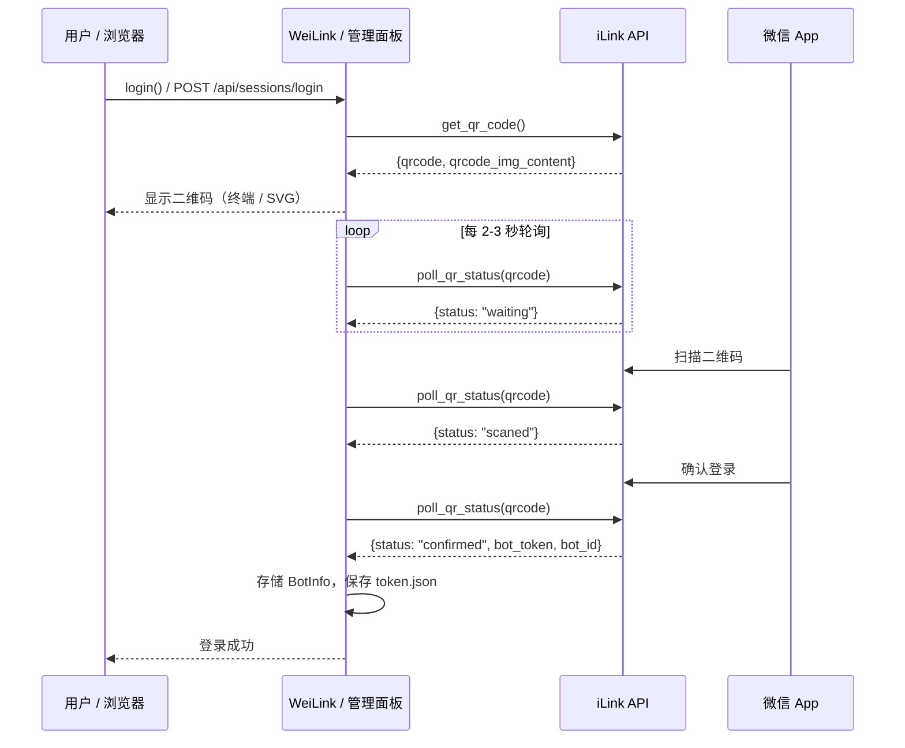

## CDN 媒体管道

媒体文件（图片、语音、文件、视频）在上传前使用 AES-128-ECB 加密，下载后解密。加密密钥由 iLink API 提供。

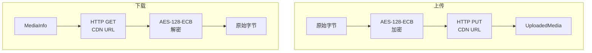

### AES 加密策略

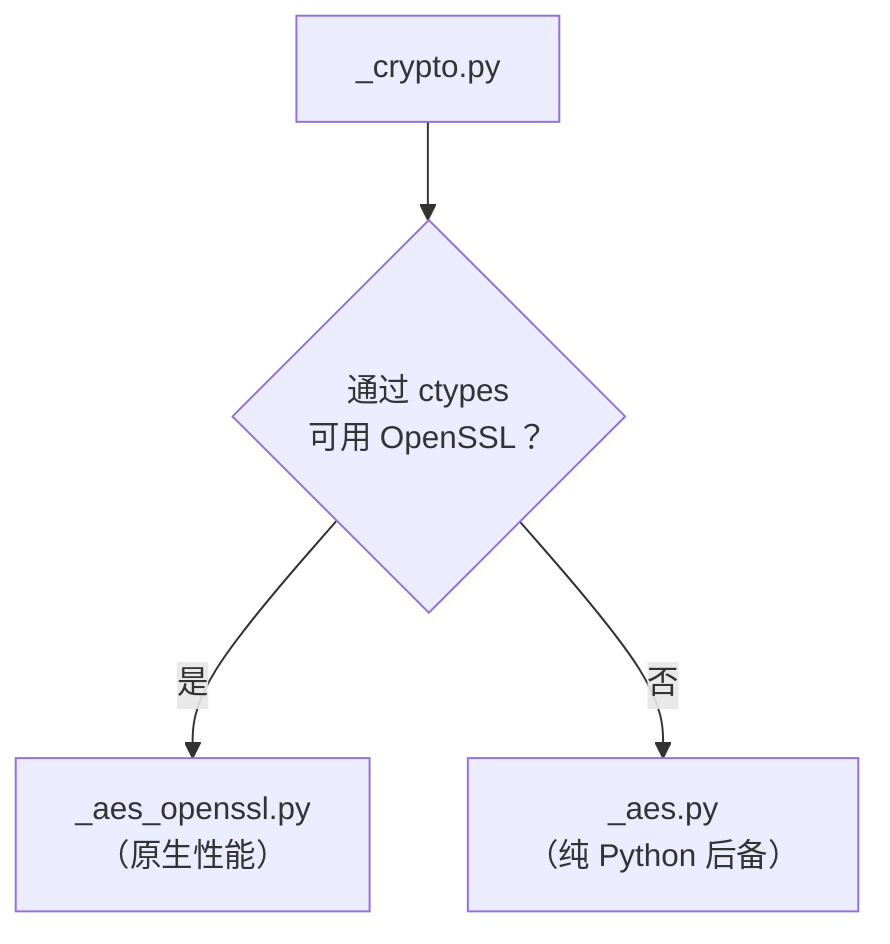

本库**零运行时依赖**。AES 加密首先尝试通过 `ctypes` 加载 OpenSSL 以获得原生性能。如果不可用（例如某些精简容器），则回退到内置的纯 Python AES 实现。

## 管理面板架构

管理面板是一个可选的 Web UI，用于在无需终端的情况下管理会话。它作为守护线程运行在 WeiLink 进程内部。

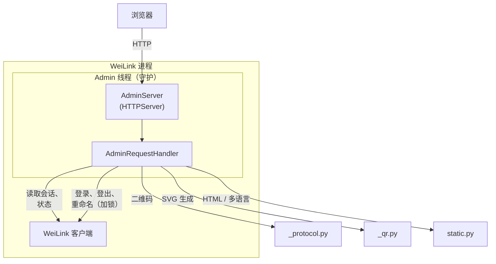

### 管理面板 API 端点

| 方法 | 路径 | 描述 |
|------|------|------|
| GET | `/` | 提供单页管理 UI |
| GET | `/api/status` | 版本、连接状态、会话数 |
| GET | `/api/sessions` | 所有会话及用户详情 |
| POST | `/api/sessions/login` | 启动二维码登录流程 |
| GET | `/api/sessions/login/status` | 轮询扫码状态 |
| POST | `/api/sessions/{name}/logout` | 登出会话 |
| POST | `/api/sessions/{name}/rename` | 重命名会话 |
| GET | `/locales/{lang}.json` | 提供国际化语言文件 |

### 线程安全

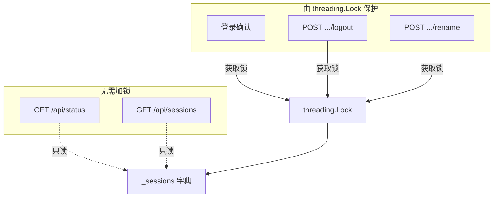

只读端点（状态、会话列表）无需加锁即可访问会话数据。写操作（登录确认、登出、重命名）通过 `threading.Lock` 串行化，防止竞态条件。

## 双模式服务器架构

WeiLink 使用 [toolregistry-server](https://github.com/Oaklight/toolregistry) 将 bot 工具通过 **MCP** 和 **OpenAPI** 两种协议暴露，基于同一套工具定义。

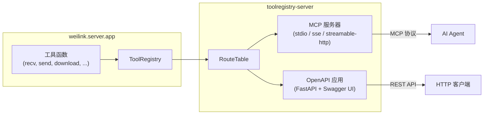

工具以异步 Python 函数形式定义在 `weilink.server.app` 中，注册到 `ToolRegistry`，然后通过任一传输方式提供服务：

- **`weilink mcp`** — 使用 `toolregistry_server.mcp` 创建 MCP 服务器
- **`weilink openapi`** — 使用 `toolregistry_server.openapi` 创建 FastAPI 应用

两种模式共享同一个全局 `WeiLink` 客户端实例和消息缓存。
