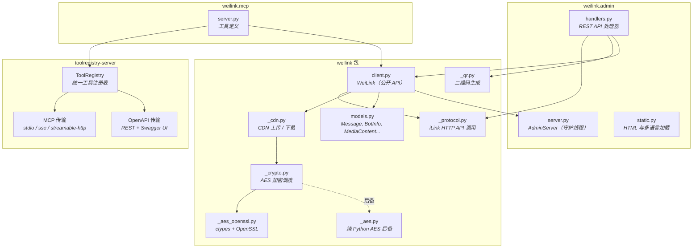
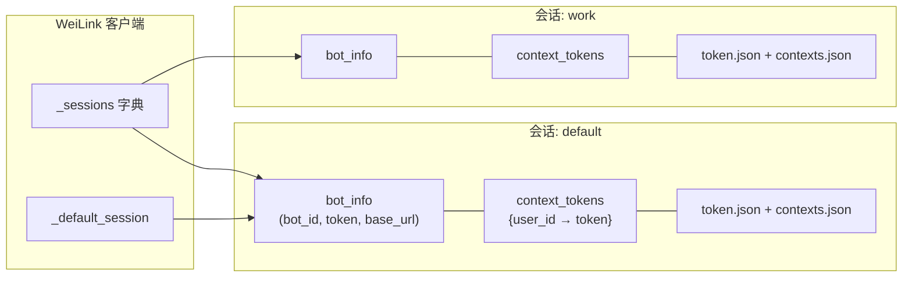
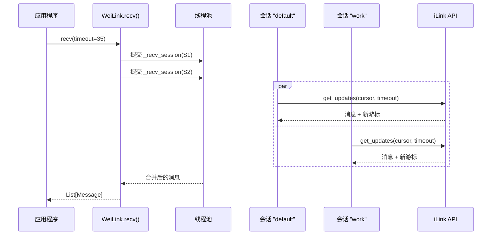
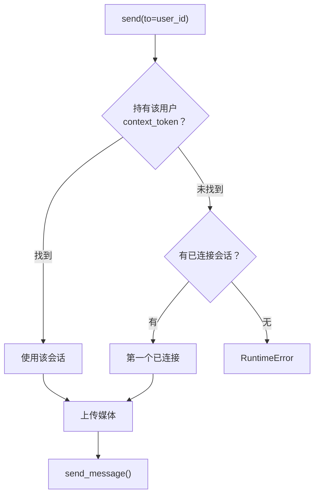
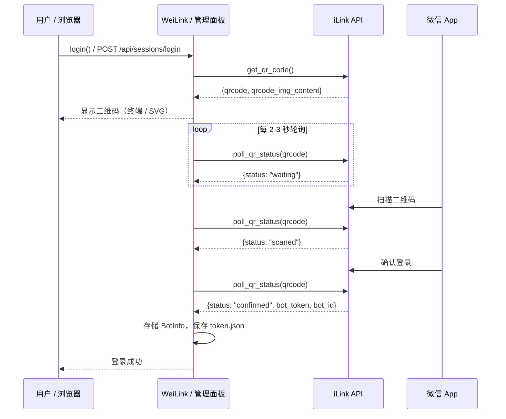
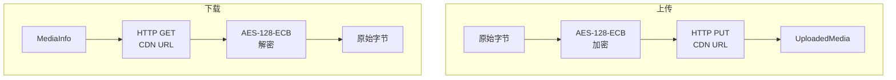
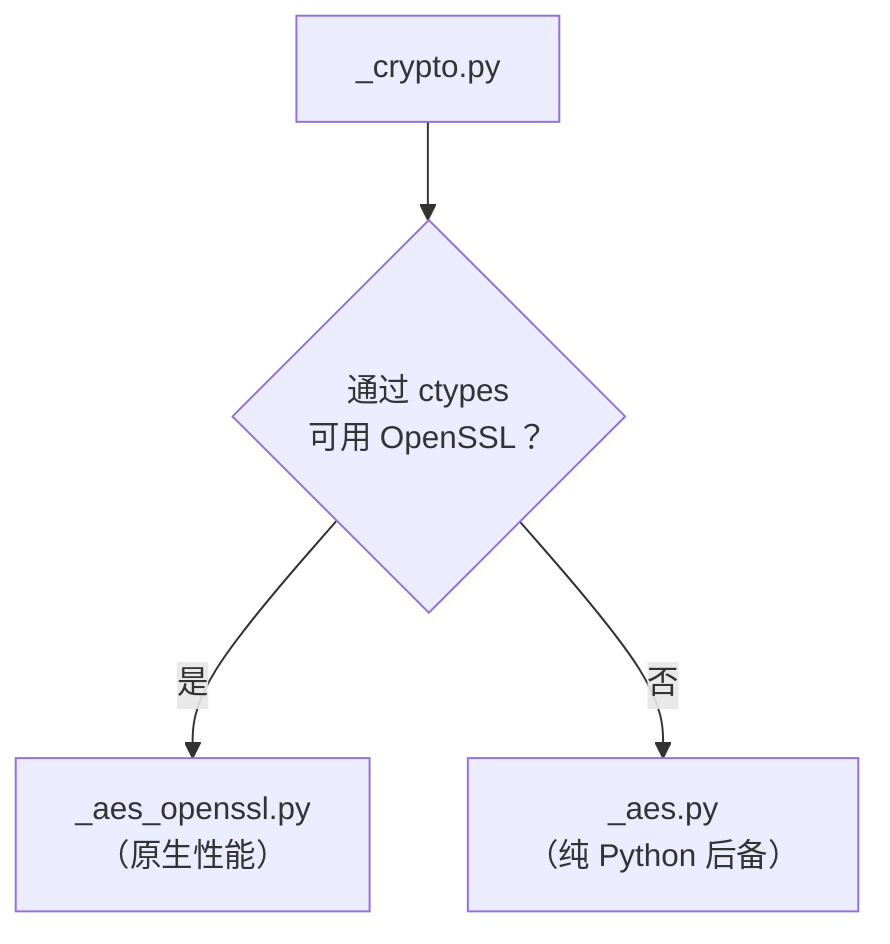
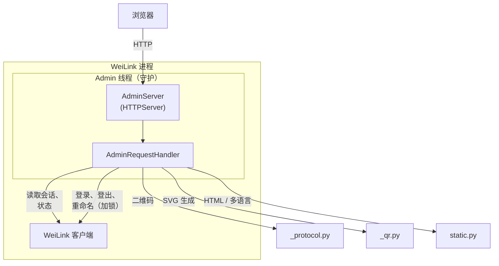
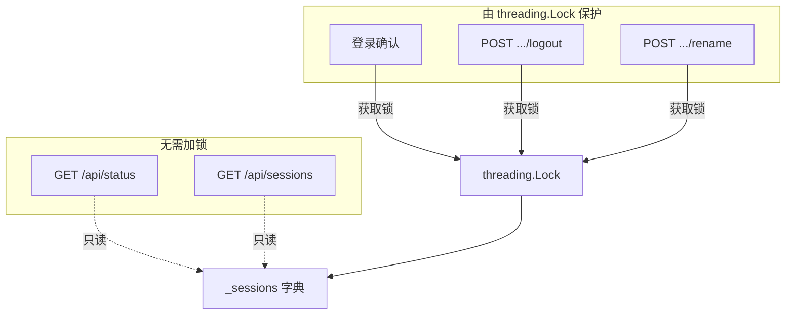

# 架构

本页介绍 WeiLink 的内部架构，包括模块结构、消息路由、登录流程、媒体处理及可选的管理面板。

## 包结构

## 多会话架构

WeiLink 支持多个并发会话。每个会话代表一个独立的微信账号注册到机器人。

### 接收流程

`recv()` 使用线程池**并行轮询所有活跃会话**，将结果合并为统一的消息列表。每条 `Message` 都携带 `bot_id` 字段，标识它来自哪个会话。

### 发送路由

`send()` 根据目标用户最近的 `context_token` 所在会话**自动路由**到正确的会话。无需手动指定会话。

## 二维码登录流程

登录使用微信手机端扫描二维码完成。无论从终端还是管理面板发起，流程相同。

## CDN 媒体管道

媒体文件（图片、语音、文件、视频）在上传前使用 AES-128-ECB 加密，下载后解密。加密密钥由 iLink API 提供。

### AES 加密策略

本库**零运行时依赖**。AES 加密首先尝试通过 `ctypes` 加载 OpenSSL 以获得原生性能。如果不可用（例如某些精简容器），则回退到内置的纯 Python AES 实现。

## 管理面板架构

管理面板是一个可选的 Web UI，用于在无需终端的情况下管理会话。它作为守护线程运行在 WeiLink 进程内部。

### 管理面板 API 端点

| 方法 | 路径 | 描述 |
|------|------|------|
| GET | `/` | 提供单页管理 UI |
| GET | `/api/status` | 版本、连接状态、会话数 |
| GET | `/api/sessions` | 所有会话及用户详情 |
| POST | `/api/sessions/login` | 启动二维码登录流程 |
| GET | `/api/sessions/login/status` | 轮询扫码状态 |
| POST | `/api/sessions/{name}/logout` | 登出会话 |
| POST | `/api/sessions/{name}/rename` | 重命名会话 |
| GET | `/locales/{lang}.json` | 提供国际化语言文件 |

### 线程安全

只读端点（状态、会话列表）无需加锁即可访问会话数据。写操作（登录确认、登出、重命名）通过 `threading.Lock` 串行化，防止竞态条件。

## 双模式服务器架构

WeiLink 使用 [toolregistry-server](https://github.com/Oaklight/toolregistry) 将 bot 工具通过 **MCP** 和 **OpenAPI** 两种协议暴露，基于同一套工具定义。

工具以异步 Python 函数形式定义在 `weilink.mcp.server` 中，注册到 `ToolRegistry`，然后通过任一传输方式提供服务：

- **`weilink mcp`** — 使用 `toolregistry_server.mcp` 创建 MCP 服务器
- **`weilink openapi`** — 使用 `toolregistry_server.openapi` 创建 FastAPI 应用

两种模式共享同一个全局 `WeiLink` 客户端实例和消息缓存。
