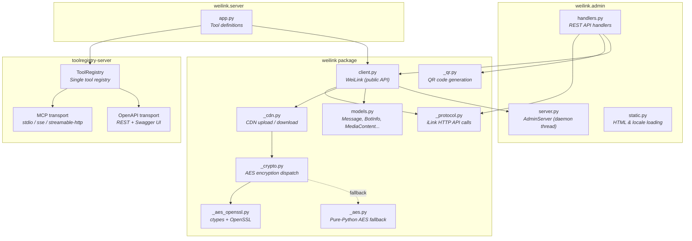
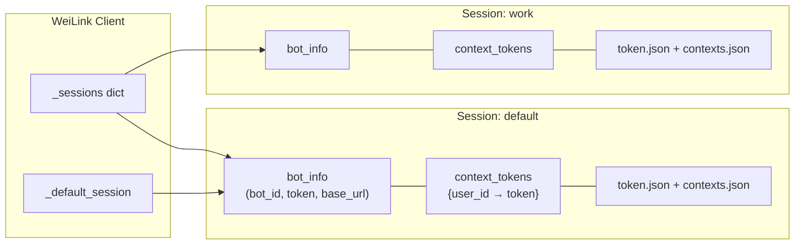
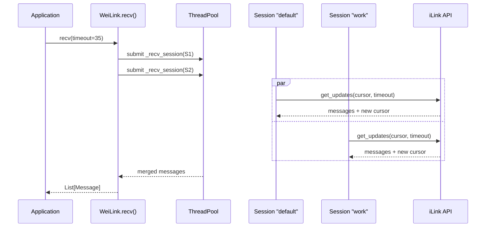
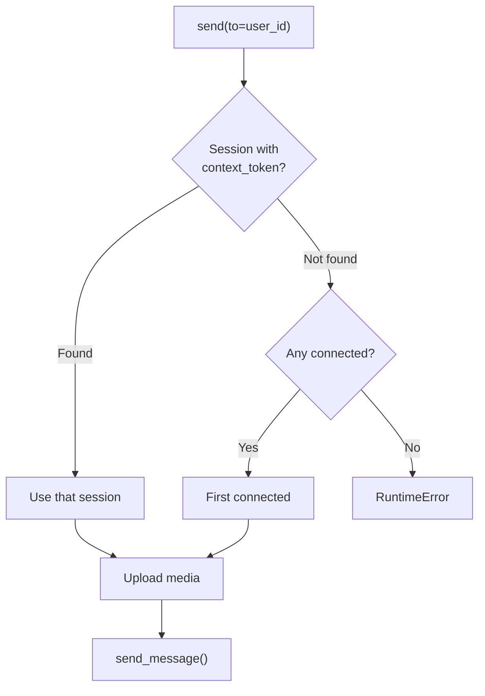
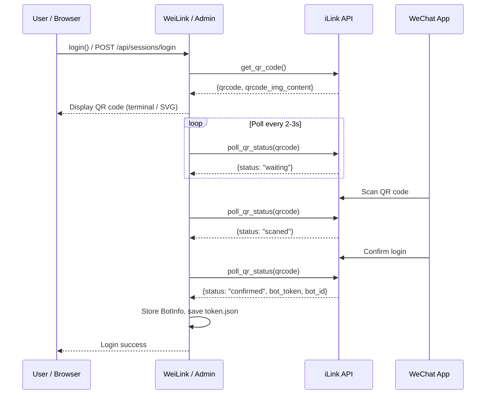
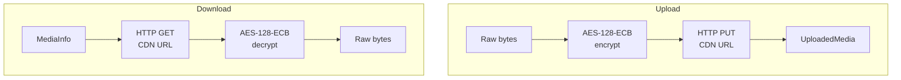
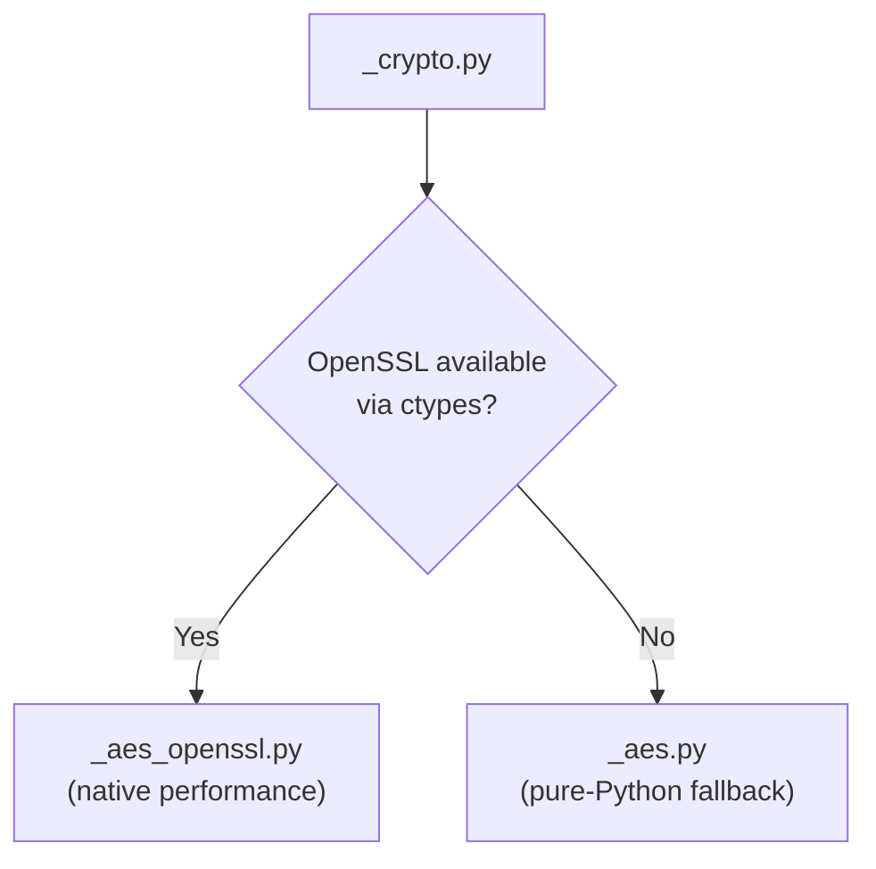
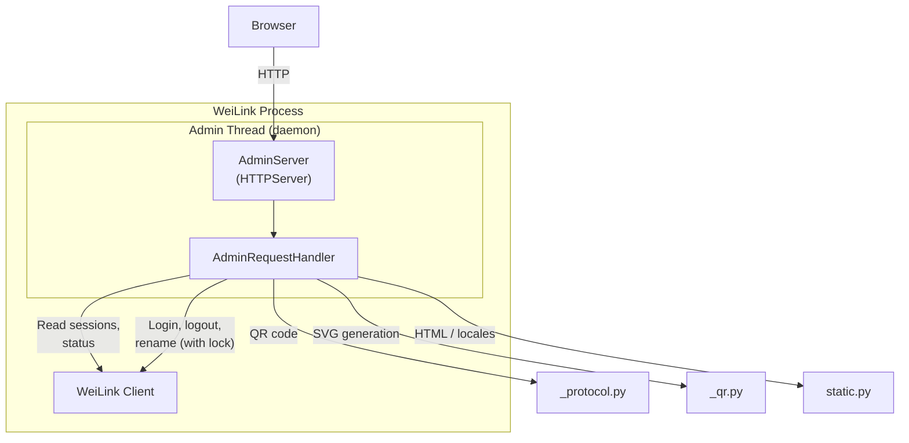
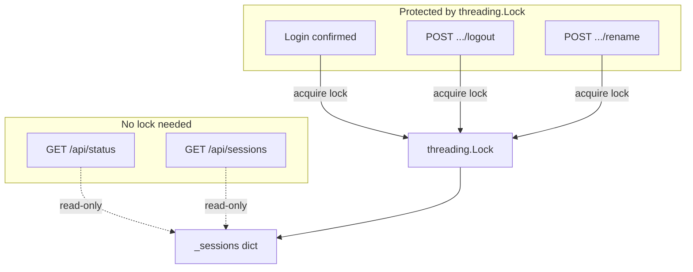
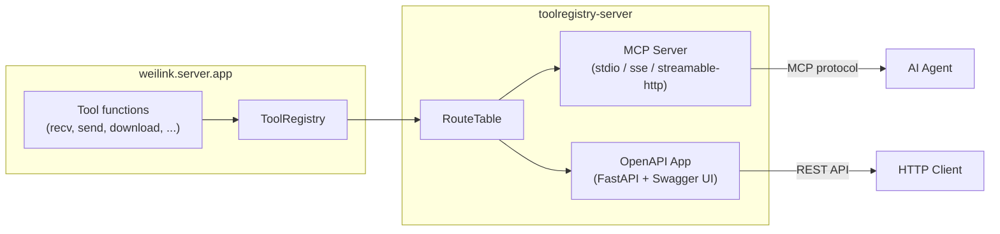

# Architecture

This page describes the internal architecture of WeiLink, including module structure, message routing, login flow, media handling, and the optional admin panel.

## Package Structure

## Multi-Session Architecture

WeiLink supports multiple concurrent sessions. Each session represents a separate WeChat account registered with the bot.

### Receive Flow

`recv()` polls **all active sessions in parallel** using a thread pool, merging results into a single message list. Each `Message` carries a `bot_id` field identifying which session it came from.

### Send Routing

`send()` **auto-routes** to the correct session based on which session most recently held a `context_token` for the target user. No manual session selection needed.

## QR Code Login Flow

Login uses a QR code scanned by the WeChat mobile app. The flow works the same whether initiated from the terminal or the admin panel.

## CDN Media Pipeline

Media (images, voice, files, video) is encrypted with AES-128-ECB before upload and decrypted after download. The encryption key is provided by the iLink API.

### AES Encryption Strategy

The library ships with **zero runtime dependencies**. AES encryption first tries to load OpenSSL via `ctypes` for native performance. If unavailable (e.g., on some minimal containers), it falls back to a vendored pure-Python AES implementation.

## Admin Panel Architecture

The admin panel is an optional web UI for managing sessions without terminal access. It runs as a daemon thread inside the WeiLink process.

### Admin API Endpoints

| Method | Path | Description |
|--------|------|-------------|
| GET | `/` | Serve single-page admin UI |
| GET | `/api/status` | Version, connection status, session count |
| GET | `/api/sessions` | All sessions with user details |
| POST | `/api/sessions/login` | Start QR login flow |
| GET | `/api/sessions/login/status` | Poll QR scan status |
| POST | `/api/sessions/{name}/logout` | Log out a session |
| POST | `/api/sessions/{name}/rename` | Rename a session |
| GET | `/locales/{lang}.json` | Serve i18n locale file |

### Thread Safety

Read-only endpoints (status, sessions) access session data without locking. Write operations (login confirmation, logout, rename) are serialized through a `threading.Lock` to prevent race conditions.

## Dual-Mode Server Architecture

WeiLink uses [toolregistry-server](https://github.com/Oaklight/toolregistry) to expose bot tools via both **MCP** and **OpenAPI** protocols from a single set of tool definitions.

Tools are defined once as async Python functions in `weilink.server.app`, registered into a `ToolRegistry`, and then served via either transport:

- **`weilink mcp`** — creates an MCP server using `toolregistry_server.mcp`
- **`weilink openapi`** — creates a FastAPI app using `toolregistry_server.openapi`

Both modes share the same global `WeiLink` client instance and message cache.
