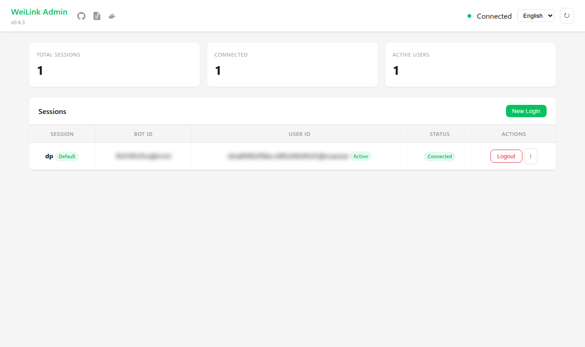
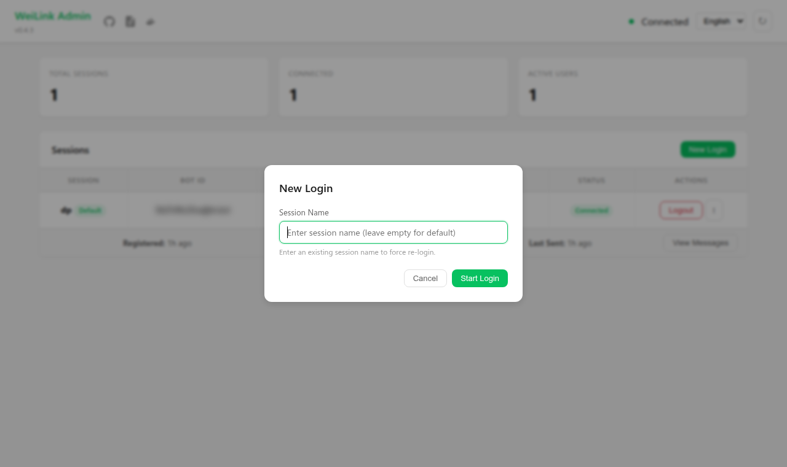
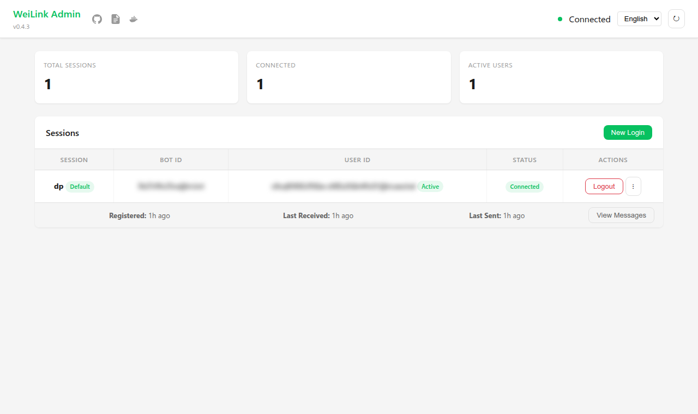
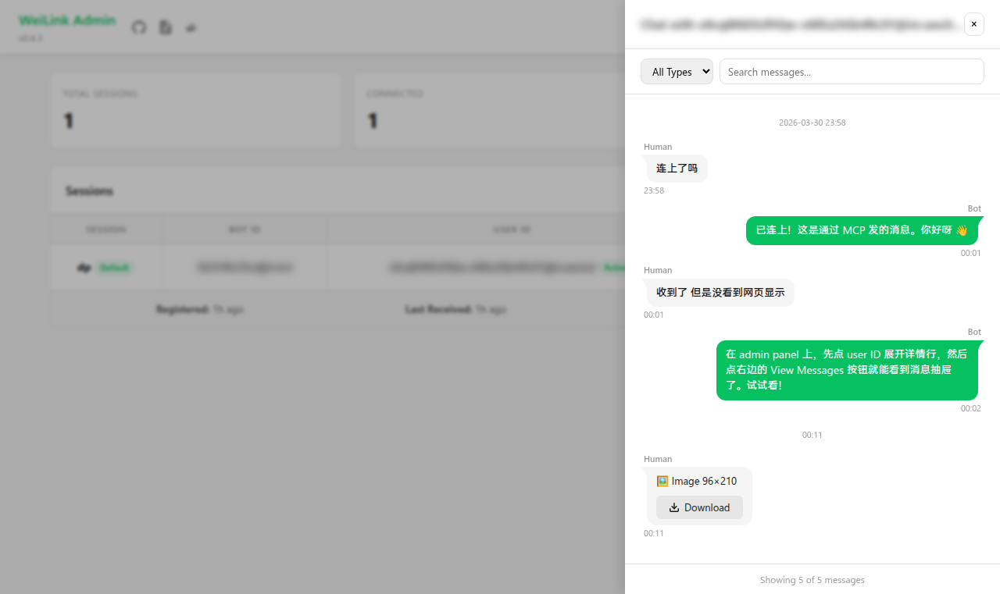

# 管理面板

WeiLink 内置 Web 管理面板，可通过浏览器管理 bot 会话。

## 快速开始

```bash
pip install weilink[server]
weilink admin -p 8080
```

在浏览器中打开 `http://localhost:8080`。CLI 选项详见 [CLI 参考](cli.md)。

## 功能

### 仪表盘

主页面展示所有会话的概览：

- 总会话数、已连接数、活跃用户数
- 连接状态指示器



### 会话管理

每行会话显示会话名、Bot ID、连接状态和关联用户。可用操作：

- **登出** — 断开会话连接
- **重命名** — 修改会话显示名称
- **设为默认** — 将会话标记为默认会话，供未指定会话名的工具使用

### 扫码登录

点击**新登录**启动扫码登录流程：

1. 可选输入会话名（或使用默认名称）
2. 用微信扫描 QR 码
3. 确认后会话出现在列表中

QR 码 5 分钟后过期，可手动刷新。



### 用户追踪

展开会话行可查看每个用户的详细信息：

- 首次出现 / 最后收到消息 / 最后发送消息的时间戳
- Token 状态（活跃或 24 小时无活动后过期）



### 消息历史

启用消息持久化（`message_store=True`）后，每个用户行会显示**查看消息**按钮。点击后打开消息抽屉：

- **微信风格气泡** — 收到的消息在左侧（灰色），发送的消息在右侧（绿色），带有发送者标签和圆滑的气泡尾巴
- **消息类型** — 文本、图片、语音、文件和视频消息，带有类型图标和元数据（尺寸、时长、文件名）
- **懒加载下载** — 点击媒体消息下方的下载按钮，按需从 CDN 拉取文件；无本地缓存
- **分页** — 顶部"加载更早消息"按钮
- **过滤** — 按消息类型下拉选择或搜索文本内容

MCP 和 OpenAPI 服务模式下默认开启消息持久化。在 SDK 中启用：

```python
wl = WeiLink(message_store=True)
```



### 多语言

面板支持中文和英文，自动检测浏览器语言，也可通过顶栏的语言选择器手动切换。

## 与服务器一起运行

管理面板可以单独运行，也可以与 MCP / OpenAPI 服务器一起运行：

```bash
# 单独运行
weilink admin -p 8080

# 与 MCP 服务器一起
weilink mcp -t sse -p 8000 --admin-port 8080

# 与 OpenAPI 服务器一起
weilink openapi -p 8000 --admin-port 8080
```

使用 `--admin-port` 时，管理面板与服务器共享同一进程和会话状态。

## Docker

默认 Docker 镜像同时运行 MCP SSE + 管理面板。详见 [Docker 部署](docker.md)。
