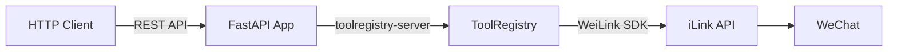

# OpenAPI Server

WeiLink provides an optional OpenAPI (REST API) server that exposes the same bot tools available via MCP as standard HTTP endpoints, complete with auto-generated Swagger UI documentation.

## Install

```bash
pip install weilink[openapi]
```

This installs [toolregistry-server](https://github.com/Oaklight/toolregistry) with OpenAPI support (FastAPI + Uvicorn) alongside the core package.

!!! tip "MCP + OpenAPI"
    To install both MCP and OpenAPI server support in one go:

    ```bash
    pip install weilink[server]
    ```

## Run

```bash
# Start on default port 8000
weilink openapi

# Custom host and port
weilink openapi --host 0.0.0.0 --port 9000

# With admin panel in the same process
weilink openapi --host 0.0.0.0 -p 8000 --admin-port 8080
```

### CLI Options

| Option | Description | Default |
|--------|-------------|---------|
| `--host` | Host address to bind to | `127.0.0.1` |
| `-p, --port` | Port number | `8000` |
| `-d, --base-path` | Data directory (profile path) | `~/.weilink/` |
| `--admin-port` | Also start admin panel on this port (same host) | *(disabled)* |
| `--log-level` | Logging level (`DEBUG`, `INFO`, `WARNING`, `ERROR`) | `INFO` |
| `--no-banner` | Suppress the ASCII banner on startup | *(off)* |

## Available Endpoints

Once the server is running, the following endpoints are available:

| Method | Path | Description |
|--------|------|-------------|
| GET | `/docs` | Swagger UI (interactive API documentation) |
| GET | `/openapi.json` | OpenAPI schema (JSON) |
| GET | `/tools` | List all available tools |
| POST | `/tools/default/{tool_name}` | Invoke a tool by name |

### Tools

The same 9 tools available in the [MCP server](mcp.md#available-tools) are exposed as REST endpoints:

- `recv` — poll for new messages
- `send` — send text and/or media
- `download` — download media from a received message
- `history` — query message history from persistent store
- `sessions` — list all sessions and their status
- `login` — QR code login with built-in polling
- `logout` — log out a session
- `rename_session` — rename a session
- `set_default` — set a session as the default

## Example Usage

### List available tools

```bash
curl http://localhost:8000/tools
```

### Receive messages

```bash
curl -X POST http://localhost:8000/tools/default/recv \
    -H "Content-Type: application/json" \
    -d '{"timeout": 5}'
```

### Send a text message

```bash
curl -X POST http://localhost:8000/tools/default/send \
    -H "Content-Type: application/json" \
    -d '{"to": "user123@im.wechat", "text": "Hello from REST API!"}'
```

### List sessions

```bash
curl -X POST http://localhost:8000/tools/default/sessions \
    -H "Content-Type: application/json" \
    -d '{}'
```

### Login

```bash
# Start login flow
curl -X POST http://localhost:8000/tools/default/login \
    -H "Content-Type: application/json" \
    -d '{"session_name": ""}'

# Poll for status (call repeatedly)
curl -X POST http://localhost:8000/tools/default/login \
    -H "Content-Type: application/json" \
    -d '{"timeout": 30}'
```

## Swagger UI

Open `http://localhost:8000/docs` in your browser to explore the API interactively. The Swagger UI provides:

- Full endpoint documentation with request/response schemas
- A "Try it out" button for each endpoint
- Auto-generated from the tool function signatures and docstrings

## Architecture



The OpenAPI server shares the same tool definitions and `WeiLink` client instance as the MCP server. Tools are defined once and exposed via both protocols through [toolregistry-server](https://github.com/Oaklight/toolregistry). See [Architecture](../architecture.md#dual-mode-server-architecture) for details.
