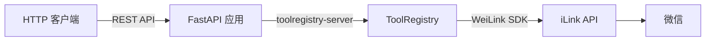

# OpenAPI 服务器

WeiLink 提供可选的 OpenAPI（REST API）服务器，将 MCP 中相同的 bot 工具以标准 HTTP 端点暴露，并附带自动生成的 Swagger UI 文档。

## 安装

```bash
pip install weilink[openapi]
```

这会在核心包之外安装 [toolregistry-server](https://github.com/Oaklight/toolregistry) 的 OpenAPI 支持（FastAPI + Uvicorn）。

!!! tip "MCP + OpenAPI"
    一次性安装 MCP 和 OpenAPI 服务器支持：

    ```bash
    pip install weilink[server]
    ```

## 运行

```bash
# 在默认端口 8000 启动
weilink openapi

# 自定义地址和端口
weilink openapi --host 0.0.0.0 --port 9000

# 同一进程中同时启动管理面板
weilink openapi --host 0.0.0.0 -p 8000 --admin-port 8080
```

### CLI 选项

| 选项 | 说明 | 默认值 |
|------|------|--------|
| `--host` | 绑定地址 | `127.0.0.1` |
| `-p, --port` | 端口号 | `8000` |
| `-d, --base-path` | 数据目录（Profile 路径） | `~/.weilink/` |
| `--admin-port` | 同时在此端口启动管理面板（共用 host） | *（不启用）* |
| `--log-level` | 日志级别（`DEBUG`、`INFO`、`WARNING`、`ERROR`） | `INFO` |
| `--no-banner` | 抑制启动时的 ASCII 横幅 | *（关闭）* |

## 可用端点

服务器启动后，以下端点可用：

| 方法 | 路径 | 描述 |
|------|------|------|
| GET | `/docs` | Swagger UI（交互式 API 文档） |
| GET | `/openapi.json` | OpenAPI schema（JSON） |
| GET | `/tools` | 列出所有可用工具 |
| POST | `/tools/default/{tool_name}` | 按名称调用工具 |

### 工具

与 [MCP 服务器](mcp.md#可用工具) 相同的 9 个工具以 REST 端点暴露：

- `recv` — 轮询接收新消息
- `send` — 发送文本和/或媒体
- `download` — 下载已接收消息中的媒体
- `history` — 从持久化存储查询消息历史
- `sessions` — 列出所有会话及其状态
- `login` — 带内置轮询的二维码登录
- `logout` — 登出会话
- `rename_session` — 重命名会话
- `set_default` — 设置默认会话

## 使用示例

### 列出可用工具

```bash
curl http://localhost:8000/tools
```

### 接收消息

```bash
curl -X POST http://localhost:8000/tools/default/recv \
    -H "Content-Type: application/json" \
    -d '{"timeout": 5}'
```

### 发送文本消息

```bash
curl -X POST http://localhost:8000/tools/default/send \
    -H "Content-Type: application/json" \
    -d '{"to": "user123@im.wechat", "text": "Hello from REST API!"}'
```

### 列出会话

```bash
curl -X POST http://localhost:8000/tools/default/sessions \
    -H "Content-Type: application/json" \
    -d '{}'
```

### 登录

```bash
# 发起登录流程
curl -X POST http://localhost:8000/tools/default/login \
    -H "Content-Type: application/json" \
    -d '{"session_name": ""}'

# 轮询状态（重复调用）
curl -X POST http://localhost:8000/tools/default/login \
    -H "Content-Type: application/json" \
    -d '{"timeout": 30}'
```

## Swagger UI

在浏览器中打开 `http://localhost:8000/docs` 可交互式浏览 API。Swagger UI 提供：

- 完整的端点文档，包含请求/响应 schema
- 每个端点的 "Try it out" 按钮
- 从工具函数签名和 docstring 自动生成

## 架构



OpenAPI 服务器与 MCP 服务器共享相同的工具定义和 `WeiLink` 客户端实例。工具只定义一次，通过 [toolregistry-server](https://github.com/Oaklight/toolregistry) 以两种协议暴露。详见 [架构](../architecture.md#双模式服务器架构)。
