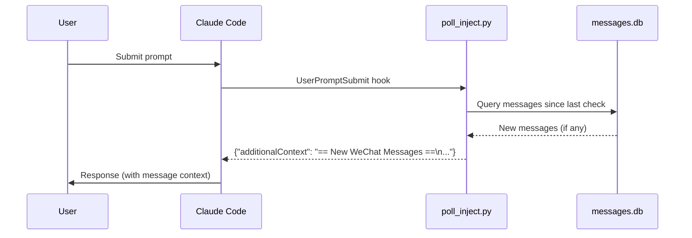

# IDE Integration

WeiLink integrates with AI coding assistants so you can receive and send WeChat messages directly from your coding session.  The `weilink setup` command automates the installation of hooks, MCP server configuration, and slash commands.

!!! tip "Prerequisite"
    Install the MCP extra first:

    ```bash
    pip install weilink[mcp]
    ```

## Supported Assistants

| Assistant | Auto-polling | MCP | Slash command | Setup command |
|-----------|-------------|-----|---------------|---------------|
| Claude Code | Yes | Yes | `/weilink` | `weilink setup claude-code` |
| Codex (OpenAI) | Yes | Manual | `/weilink` | `weilink setup codex` |
| OpenCode | No | Yes | `/weilink` | `weilink setup opencode` |

## Claude Code

```bash
weilink setup claude-code
```

This creates a symlink at `~/.claude/plugins/weilink/` pointing to the bundled integration assets.  After installation, restart Claude Code to activate.

### What gets installed

| Component | Description |
|-----------|-------------|
| **Plugin metadata** | `.claude-plugin/plugin.json` |
| **MCP server** | `.mcp.json` — registers `weilink mcp` as a stdio MCP server |
| **Polling hook** | `hooks/hooks.json` + `hooks/poll_inject.py` — auto-injects new WeChat messages on each prompt |
| **Skill** | `skills/weilink/SKILL.md` — provides `/weilink` slash command |

### How auto-polling works



Every time you submit a prompt, the `UserPromptSubmit` hook runs `weilink hook-poll` to check the local SQLite message store for new messages received since the last check.  If there are new messages, they are injected into Claude's context as `additionalContext`.  This is a **local-only** operation (no network call) and typically completes in under 100ms.

!!! note
    Auto-polling reads from the local message store.  Messages only appear in the store after a `recv` call (manual or via MCP).  If the MCP server is running in the background (e.g. via `weilink mcp -t http`), messages are received automatically.

### Options

| Option | Description |
|--------|-------------|
| `--uninstall` | Remove the plugin |
| `--copy` | Copy files instead of symlinking (use on Windows) |
| `--json` | Output result as JSON |

## Codex (OpenAI)

```bash
weilink setup codex
```

Installs a hook script, merges hook registration into `~/.codex/hooks.json`, and copies the `/weilink` slash command.

### What gets installed

| Component | Location |
|-----------|----------|
| **Hook script** | `~/.codex/hooks/weilink_poll_inject.py` |
| **Hook registration** | Merged into `~/.codex/hooks.json` |
| **Slash command** | `~/.codex/commands/weilink.md` |

### MCP registration

The MCP server must be registered separately after setup:

```bash
codex mcp add weilink -- weilink mcp
```

### Options

| Option | Description |
|--------|-------------|
| `--uninstall` | Remove the integration |
| `--json` | Output result as JSON |

## OpenCode

```bash
weilink setup opencode
```

Adds the WeiLink MCP server to `~/.config/opencode/opencode.json` and installs the `/weilink` slash command.

### What gets installed

| Component | Location |
|-----------|----------|
| **MCP config** | `mcp.weilink` entry in `~/.config/opencode/opencode.json` |
| **Slash command** | `~/.config/opencode/commands/weilink.md` |

!!! info "No auto-polling"
    OpenCode does not support shell-based hooks, so automatic message injection is not available.  Use the `recv` MCP tool or the `/weilink check` command to poll for new messages explicitly.

### Options

| Option | Description |
|--------|-------------|
| `--uninstall` | Remove the integration |
| `--json` | Output result as JSON |

## Manual Configuration

For other tools (Cursor, VS Code, Claude Desktop, etc.), configure the MCP server manually.  See [MCP Server — Client Configuration](mcp.md#client-configuration) for examples.

To add auto-polling to a tool that supports `UserPromptSubmit` hooks, create a hook that runs:

```bash
weilink hook-poll
```

The command outputs JSON:

```json
{"has_messages": true, "count": 3, "context": "== New WeChat Messages ==\n..."}
```

Wrap the `context` value as `{"additionalContext": "<context>"}` in your hook's stdout.

## `weilink hook-poll`

Internal command used by hook scripts.  Reads the local SQLite message store for messages received since the last check.

```bash
weilink hook-poll                # Poll for new messages
weilink hook-poll --limit 50     # Return up to 50 messages
weilink hook-poll --reset        # Clear poll state and exit
```

| Option | Description | Default |
|--------|-------------|---------|
| `-d, --base-path` | Data directory | `~/.weilink/` |
| `--limit` | Max messages to return | `20` |
| `--reset` | Clear the state file and exit | *(off)* |
| `--log-level` | Logging level | `WARNING` |

State is tracked in `~/.weilink/.hook_state.json`.  On first run (or after `--reset`), it looks back 5 minutes.
