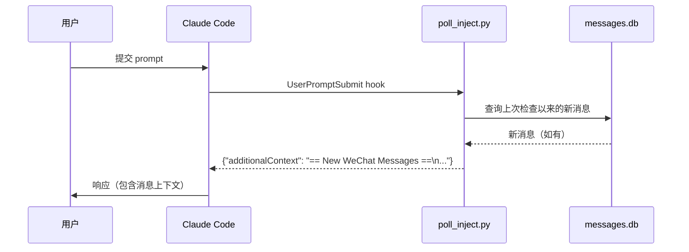

# IDE 集成

WeiLink 可以集成到 AI 编程助手中，让你在编程会话中直接收发微信消息。`weilink setup` 命令自动完成 hooks、MCP 服务器配置和 slash 命令的安装。

!!! tip "前置条件"
    先安装 MCP 扩展：

    ```bash
    pip install weilink[mcp]
    ```

## 支持的助手

| 助手 | 自动轮询 | MCP | Slash 命令 | 安装命令 |
|------|---------|-----|-----------|---------|
| Claude Code | 支持 | 支持 | `/weilink` | `weilink setup claude-code` |
| Codex (OpenAI) | 支持 | 需手动注册 | `/weilink` | `weilink setup codex` |
| OpenCode | 不支持 | 支持 | `/weilink` | `weilink setup opencode` |

## Claude Code

```bash
weilink setup claude-code
```

在 `~/.claude/plugins/weilink/` 创建软链接，指向内置的集成资源目录。安装后重启 Claude Code 即可激活。

### 安装内容

| 组件 | 说明 |
|------|------|
| **插件元数据** | `.claude-plugin/plugin.json` |
| **MCP 服务器** | `.mcp.json` — 注册 `weilink mcp` 为 stdio MCP 服务器 |
| **轮询 Hook** | `hooks/hooks.json` + `hooks/poll_inject.py` — 每次提交 prompt 时自动注入新微信消息 |
| **Skill** | `skills/weilink/SKILL.md` — 提供 `/weilink` slash 命令 |

### 自动轮询原理



每次提交 prompt 时，`UserPromptSubmit` hook 运行 `weilink hook-poll` 检查本地 SQLite 消息存储中自上次检查以来收到的新消息。如果有新消息，会以 `additionalContext` 的形式注入到 Claude 的上下文中。这是一个**纯本地操作**（无网络调用），通常在 100ms 内完成。

!!! note
    自动轮询从本地消息存储读取。消息只有在 `recv` 调用（手动或通过 MCP）后才会出现在存储中。如果 MCP 服务器在后台运行（如 `weilink mcp -t http`），消息会自动接收。

### 选项

| 选项 | 说明 |
|------|------|
| `--uninstall` | 移除插件 |
| `--copy` | 复制文件而不是创建软链接（用于 Windows） |
| `--json` | 以 JSON 格式输出结果 |

## Codex (OpenAI)

```bash
weilink setup codex
```

安装 hook 脚本，将 hook 注册合并到 `~/.codex/hooks.json`，并复制 `/weilink` slash 命令。

### 安装内容

| 组件 | 位置 |
|------|------|
| **Hook 脚本** | `~/.codex/hooks/weilink_poll_inject.py` |
| **Hook 注册** | 合并到 `~/.codex/hooks.json` |
| **Slash 命令** | `~/.codex/commands/weilink.md` |

### MCP 注册

安装后需手动注册 MCP 服务器：

```bash
codex mcp add weilink -- weilink mcp
```

### 选项

| 选项 | 说明 |
|------|------|
| `--uninstall` | 移除集成 |
| `--json` | 以 JSON 格式输出结果 |

## OpenCode

```bash
weilink setup opencode
```

将 WeiLink MCP 服务器添加到 `~/.config/opencode/opencode.json`，并安装 `/weilink` slash 命令。

### 安装内容

| 组件 | 位置 |
|------|------|
| **MCP 配置** | `~/.config/opencode/opencode.json` 中的 `mcp.weilink` 条目 |
| **Slash 命令** | `~/.config/opencode/commands/weilink.md` |

!!! info "无自动轮询"
    OpenCode 不支持 shell 命令 hook，因此无法自动注入消息。请使用 `recv` MCP 工具或 `/weilink check` 命令手动获取新消息。

### 选项

| 选项 | 说明 |
|------|------|
| `--uninstall` | 移除集成 |
| `--json` | 以 JSON 格式输出结果 |

## 手动配置

对于其他工具（Cursor、VS Code、Claude Desktop 等），请手动配置 MCP 服务器。参见 [MCP 服务器 — 客户端配置](mcp.md#客户端配置) 中的示例。

如果你的工具支持 `UserPromptSubmit` hook，可以创建一个 hook 运行：

```bash
weilink hook-poll
```

该命令输出 JSON：

```json
{"has_messages": true, "count": 3, "context": "== New WeChat Messages ==\n..."}
```

将 `context` 值包装为 `{"additionalContext": "<context>"}` 输出到 hook 的 stdout 即可。

## `weilink hook-poll`

Hook 脚本使用的内部命令。从本地 SQLite 消息存储中读取上次检查以来收到的消息。

```bash
weilink hook-poll                # 轮询新消息
weilink hook-poll --limit 50     # 最多返回 50 条消息
weilink hook-poll --reset        # 清除轮询状态并退出
```

| 选项 | 说明 | 默认值 |
|------|------|--------|
| `-d, --base-path` | 数据目录 | `~/.weilink/` |
| `--limit` | 最大返回消息数 | `20` |
| `--reset` | 清除状态文件并退出 | *（关闭）* |
| `--log-level` | 日志级别 | `WARNING` |

状态记录在 `~/.weilink/.hook_state.json` 中。首次运行（或 `--reset` 后）回溯 5 分钟。
